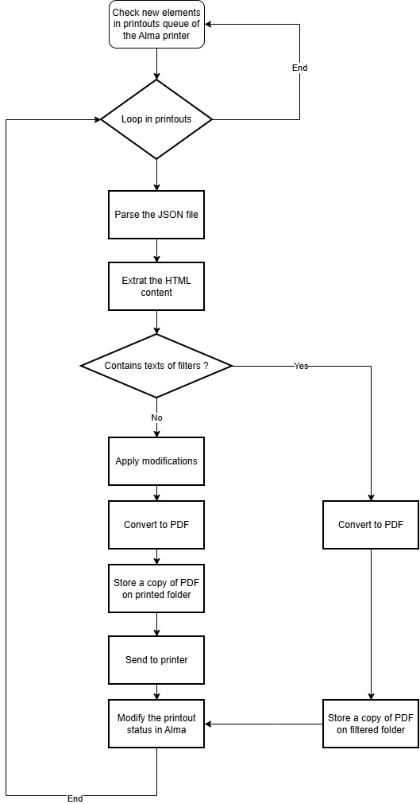

# Python and Alma's API for printing: Printing slips at circulation desks

Project developed as part of the SLSP Forum 2025 held in Zurich on 27 November 2025

## Participants

* Pablo Iriarte
* Roger Zollinger
* Andreas Ly
* Nicole Meier
* Rouven Schabinger
* Martin Brossard
* Moritz Steinmaier

## Flowchart

